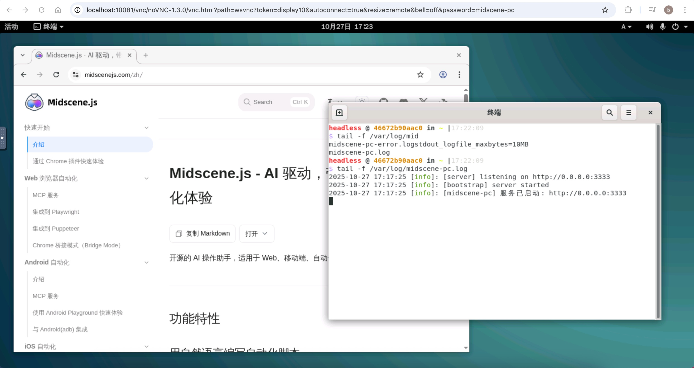

# midscene-pc

English README: [README.en.md](./README.en.md)

让 Midscene 直接控制你的桌面应用与窗口。本库提供一个 PC 设备接口及服务实现，统一鼠标、键盘、剪贴板与截图等能力，并与 `@midscene/core` 无缝协作，让你用自然语言驱动桌面自动化。

---

## 📖 简介

- 面向桌面场景的 Midscene 设备实现（`PCDevice`）。
- 提供本地服务（`localPCService`）与远程服务（`createRemotePCService`）两种模式。远程模式可以在服务器上部署一个带桌面的 docker 镜像（[DockerHub 地址](https://hub.docker.com/r/ppagent/midscene-ubuntu-desktop)），然后客户端程序就不需要在桌面环境下运行了，比如可以放到服务器上去定时运行等。
- 支持多显示器、窗口枚举与截图，封装鼠标/键盘/剪贴板操作。
- 与 `@midscene/core` 的定位与动作体系深度集成。


## 📺 演示

### 播放音乐

[]

### 搜索天气发送到聊天

[]

## 🚀 安装

> **注意：** 由于依赖的库文件需要本地化编译，耗时可能略久。

### 作为依赖集成到自己项目中

```bash
pnpm add midscene-pc
```

### 作为服务直接运行

使用 npx 直接启动服务：

```bash
npx midscene-pc@latest
```

指定端口与主机：

```bash
npx midscene-pc --port 4000 --host 127.0.0.1
```

查看帮助：

```bash
npx midscene-pc --help
```

---

## ⚙️ 环境变量配置

项目支持通过环境变量进行配置，你可以创建 `.env` 文件或设置系统环境变量：

### Midscene 配置

- `MIDSCENE_USE_QWEN3_VL`: 是否使用 Qwen3 VL 模型，默认 `true`

### OpenAI 配置

- `OPENAI_BASE_URL`: OpenAI API 基础 URL，默认 `https://dashscope.aliyuncs.com/compatible-mode/v1`
- `OPENAI_API_KEY`: OpenAI API 密钥

### 模型配置

- `MIDSCENE_MODEL_NAME`: 使用的模型名称，默认 `qwen3-vl-plus`

### 服务器配置

- `PORT`: 服务端口，默认 `3333`
- `HOST`: 服务主机，默认 `0.0.0.0`

### 日志配置

- `LOG_LEVEL`: 日志级别，默认 `info`（可选：`error`, `warn`, `info`, `http`, `verbose`, `debug`, `silly`）
- `LOG_DIR`: 日志目录，默认 `./logs`
- `LOG_MAX_SIZE`: 日志文件最大大小，默认 `20m`（支持 K、M、G 单位）
- `LOG_MAX_FILES`: 日志文件保留时间，默认 `14d`（支持 d、m 等单位）
- `LOG_DATE_PATTERN`: 日志文件日期格式，默认 `YYYY-MM-DD`
- `NODE_ENV`: 设置为 `development` 时会在控制台输出彩色日志，生产环境建议设置为 `production`

### 示例 `.env` 文件

```env
PORT=3333
HOST=0.0.0.0

# 环境配置
NODE_ENV=production

# 日志配置
LOG_LEVEL=info
LOG_DIR=./logs
LOG_MAX_SIZE=20m
LOG_MAX_FILES=14d
LOG_DATE_PATTERN=YYYY-MM-DD
```

---

## 🖥️ 跨平台提示

- **Windows**: 正常安装
- **Linux**: 需要提前安装 `libxss1`、`imagemagick`，均使用 `apt install` 直接安装
- **macOS**: 需要允许屏幕截图和鼠标键盘控制（第一次的时候会自动申请，设置里面完成后，重新启动应用），另外 macOS 模式下不要使用人工圈画截图区域的功能，Node.js 的 GUI 消息循环在 Mac 下兼容性不好
- **注意**: 由于依赖不少跨平台的本地库，因此换平台的时候需要重新 install，直接拷贝 `node_modules` 是没用的

---

## 🏃‍♂️ 快速开始（本地模式）

```typescript
import "dotenv/config";
import { PCDevice, PCAgent, localPCService } from "midscene-pc";

async function main() {
  const device = new PCDevice({
    pcService: localPCService,
    launchOptions: {
      //   windowInfo: { appName: 'Edge' },
      screenArea: {
        preferManual: true, // 启动手动绘制模式。如果不传参数，默认primary显示器，也可以传递显示器的id、截图区域等，具体可以参考代码实现
      },
    },
  });
  await device.launch(); // 必须先初始化设备

  const agent = new PCAgent(device);
  await agent.aiAction("打开谷歌，搜索 midscene");

  const answer = await agent.aiOutput("描述一下当前桌面截图"); // PCAgent增加了一个支持直接返回答案的方法。
  console.log(answer);
}

main().catch(console.error);
```

---

## 🌐 远程模式（HTTP 服务桥接）

在目标机器上启动服务，然后用 HTTP 客户端驱动：

```typescript
import "dotenv/config";
import {
  startServer,
  createRemotePCService,
  PCDevice,
  PCAgent,
} from "midscene-pc";

async function main() {
  // 测试时可以直接在本机启动服务（默认 http://0.0.0.0:3333）
  await startServer();

  // 通过 HTTP 驱动
  const pcService = createRemotePCService("http://localhost:3333");
  const device = new PCDevice({ pcService, launchOptions: {} });
  await device.launch();

  const agent = new PCAgent(device);
  await agent.aiAction("描述一下当前桌面的情况");
}

main().catch(console.error);
```

### 🐳 远程服务器安装指南



```bash
docker run -it -d --rm --name=midscene-ubuntu-desktop \
  -p 10081:10081 -p 10089:10089 -p 3333:3333 \
  --tmpfs /run --tmpfs /run/lock --tmpfs /tmp \
  --cap-add SYS_BOOT --cap-add SYS_ADMIN \
  -v /sys/fs/cgroup:/sys/fs/cgroup:rw \
  -v ./data:/mnt/data \
  --cgroupns=host --privileged --shm-size=4g \
  -e L=zh_CN \
  -e SSH_PASS=midscene-pc \
  -e VNC_PASS=midscene-pc \
  -e VNC_PASS_RO=midscene_pc \
  ppagent/midscene-ubuntu-desktop:latest
```

> **提示：** 服务默认启动在 `3333` 端口。  
> 详情可以参考 [midscene-pc-docker](https://github.com/mofangbao/midscene-pc-docker)

---

## 🎯 运行项目内示例

本仓库内置多个 demo，含本地与远程两种用法。

### 本地运行

```bash
pnpm install
pnpm dev
```

### 远程运行

```bash
# 模拟远程运行
pnpm dev --remote
```

---

## 📋 Server API 一览

| Method | Path                    | Body                    | Response            | 说明                             |
|--------|-------------------------|-------------------------|---------------------|----------------------------------|
| GET    | `/health`               | -                       | `{ ok: true }`      | 健康检查                         |
| GET    | `/monitors`             | -                       | `Monitor[]`         | 显示器列表                       |
| GET    | `/monitors/:id/capture` | -                       | `image/png`         | 指定显示器截图                   |
| POST   | `/monitor/point`        | `{ x, y }`              | `Monitor \| null`   | 点位所在显示器                   |
| GET    | `/windows`              | -                       | `Window[]`          | 窗口列表                         |
| GET    | `/windows/:id/capture`  | -                       | `image/png`         | 指定窗口截图                     |
| POST   | `/mouse/set-position`   | `{ x, y }`              | `{ success: true }` | 设置鼠标位置                     |
| GET    | `/mouse/position`       | -                       | `{ x, y }`          | 获取鼠标位置                     |
| POST   | `/mouse/click`          | `{ button }`            | `{ success: true }` | 单击（`MouseButton`）            |
| POST   | `/mouse/double-click`   | `{ button }`            | `{ success: true }` | 双击（`MouseButton`）            |
| POST   | `/mouse/press`          | `{ button }`            | `{ success: true }` | 按下（`MouseButton`）            |
| POST   | `/mouse/release`        | `{ button }`            | `{ success: true }` | 抬起（`MouseButton`）            |
| POST   | `/mouse/move`           | `{ points: Point[] }`   | `{ success: true }` | 路径移动                         |
| POST   | `/mouse/scroll/left`    | `{ distance }`          | `{ success: true }` | 水平滚动左                       |
| POST   | `/mouse/scroll/right`   | `{ distance }`          | `{ success: true }` | 水平滚动右                       |
| POST   | `/mouse/scroll/up`      | `{ distance }`          | `{ success: true }` | 垂直滚动上                       |
| POST   | `/mouse/scroll/down`    | `{ distance }`          | `{ success: true }` | 垂直滚动下                       |
| POST   | `/keyboard/press`       | `{ keys: number[] }`    | `{ success: true }` | 按下按键（`KeyCode`）            |
| POST   | `/keyboard/release`     | `{ keys: number[] }`    | `{ success: true }` | 释放按键（`KeyCode`）            |
| POST   | `/keyboard/type`        | `{ text }`              | `{ success: true }` | 输入文本                         |
| POST   | `/clipboard/set`        | `{ content }`           | `{ success: true }` | 设置剪贴板                       |
| GET    | `/clipboard/get`        | -                       | `{ content }`       | 获取剪贴板                       |
| POST   | `/screenshot`           | `{ saveFileFullPath? }` | `{ rect, monitor }` | 捕获屏幕（返回矩形与显示器信息） |

### 类型说明

- **Monitor**: `{ id, name, x, y, width, height, rotation, scaleFactor, frequency, isPrimary }`
- **Window**: `{ id, appName, title, x, y, width, height, currentMonitor: Monitor }`
- **MouseButton**、**KeyCode** 枚举以及 **Point**、**Rect** 类型来自本包导出的接口

---

## 📄 许可证

MIT

---

## 🔗 关联链接

- [Midscene.js 官网](https://midscenejs.com/)
- [模型选择指南](https://midscenejs.com/choose-a-model)
- [核心库（@midscene/core）](https://www.npmjs.com/package/@midscene/core)
